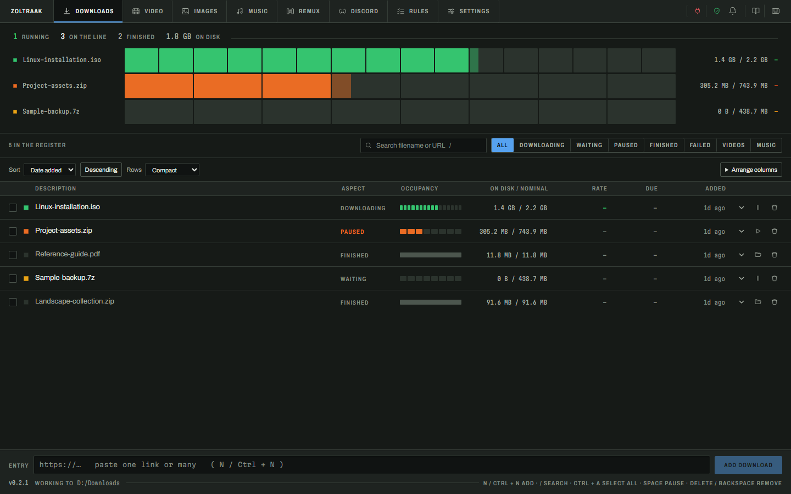
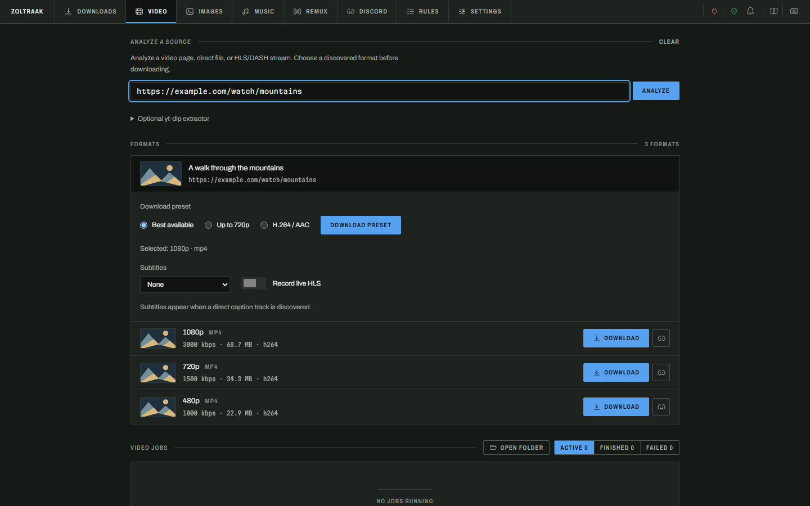
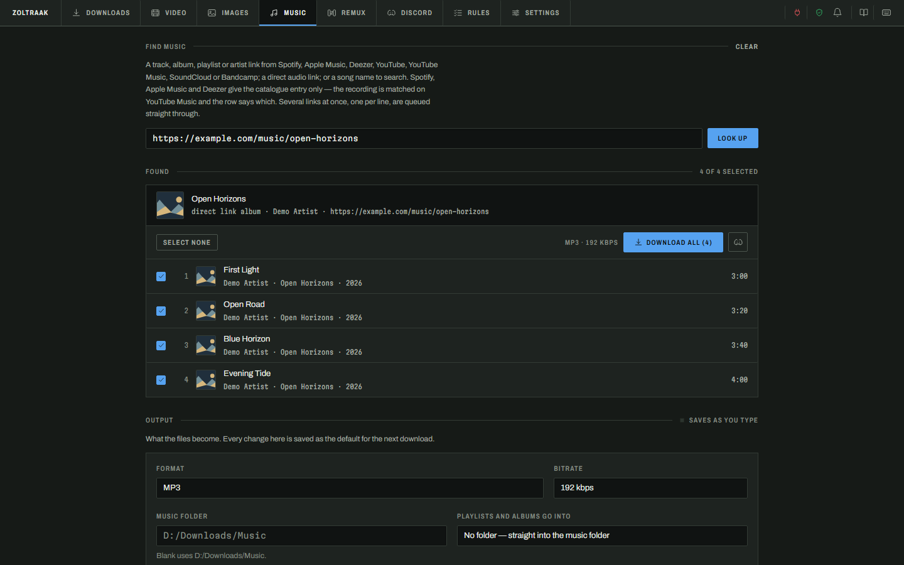
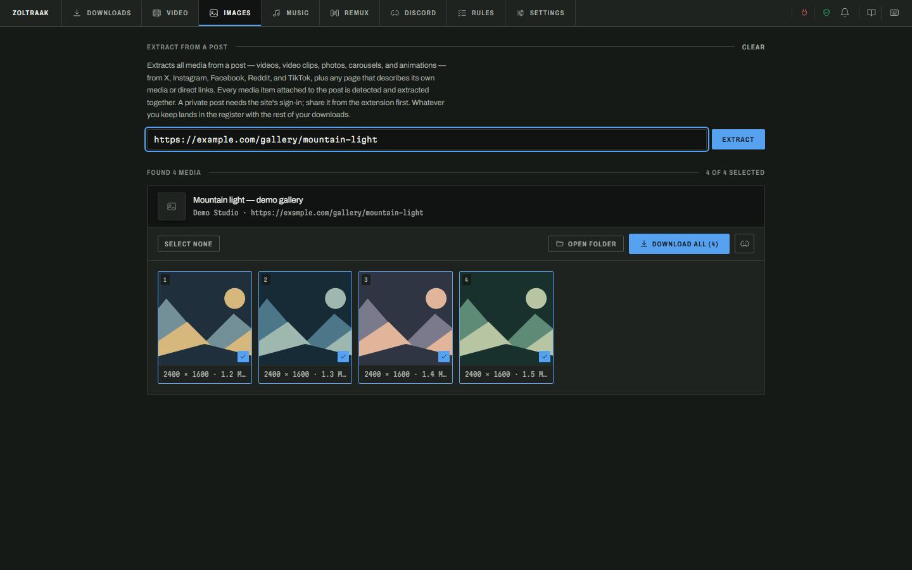
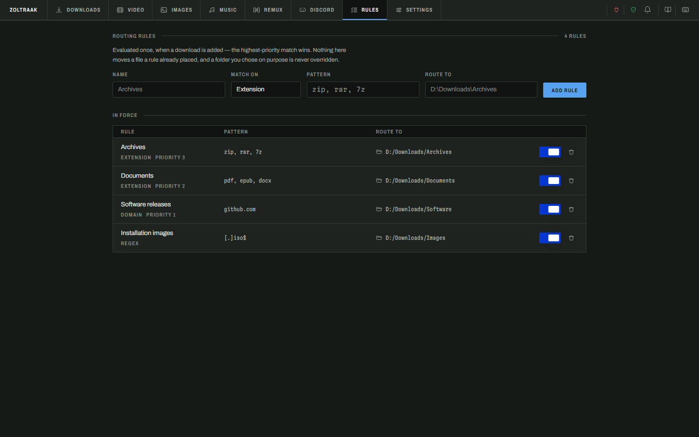

# Zoltraak

> **Zoltraak is currently invitation-only.**  
> Access is limited to invited users while the app is still being developed and refined.

Zoltraak is a desktop download manager built to make downloading and organizing files, videos, music, and images easier — without having to jump between different tools.

It combines a traditional download manager with browser integration, media detection, format selection, music organization, automatic folder routing, and other utilities in one desktop app.

## Features

- **Fast & resumable downloads**  
  Download files over HTTP/HTTPS using multiple connections when supported by the source. Downloads can be paused, resumed, retried, and recovered after restarting Zoltraak.

- **Download queue**  
  Keep everything in one place with priorities, concurrent download limits, search, status filters, multi-select, and bulk actions. You can also set a global bandwidth limit when you don't want downloads taking over your connection.

- **Browser integration**  
  Send links directly to Zoltraak using the companion browser extension. On supported websites, the extension can also pass the browser session needed to access media available to your signed-in account.

- **Video downloads**  
  Paste a webpage, media URL, or supported HLS/DASH stream and let Zoltraak discover the available formats. Pick the resolution and format you want before downloading. If audio and video are provided separately, Zoltraak can merge them automatically using local media tools.

- **Music downloads & organization**  
  Add individual tracks, albums, or playlists, choose your preferred audio format, and organize the result with folders, metadata, cover art, and customizable filenames.

  Spotify, Apple Music, and Deezer links are used for catalogue and track information. Zoltraak then attempts to match the recording through YouTube Music rather than downloading protected audio directly from those services. Matching depends on the recording being available and is not intended to bypass DRM.

- **Images & galleries**  
  Extract images from supported posts and pages, preview what was found, select only the files you want, and add them directly to the download queue.

- **Automatic folder routing**  
  Create rules that organize new downloads based on file extension, website/domain, or regular expressions. Manually selected destinations always take priority.

- **Download scheduling**  
  Set a daily download window for queues that you don't want running all day. Zoltraak can also perform an action when everything finishes, such as opening the download folder or closing the app.

- **Remuxing & conversion**  
  Convert or remux downloaded and local audio/video files into another container or format. Stream copying keeps the original quality when possible, while re-encoding is available when conversion is required.

- **Discord delivery**  
  Automatically send completed files to a Discord channel using a webhook or your own bot. Zoltraak can prepare media around the configured upload limit while keeping the original downloaded file untouched.

> **Note:** Some media features require `ffmpeg` and `ffprobe` to be installed locally. Available formats and download methods can also vary depending on the source website, authentication requirements, and what the source itself provides.

---

## Screenshot Showcase

A look at the current Zoltraak interface.

### Downloads

See everything that's downloading, queued, paused, or already completed from a single view.

### Video

Analyze a video source, see the formats Zoltraak discovers, and choose exactly what you want to download.

### Music

Preview tracks in an album or playlist and configure the audio format, folder structure, metadata, artwork, and naming before downloading.

### Images

Extract a gallery, preview the results, and choose which images you actually want to keep.

### Rules

Let Zoltraak organize new downloads automatically with rules based on extensions, domains, or custom patterns.

---

## Availability

Zoltraak is still under active development and is currently available **by invitation only**.

This repository is intended to showcase the application, its features, screenshots, and release information. It does not provide public access to Zoltraak at this time.

Public availability may come later as the project becomes more mature.
